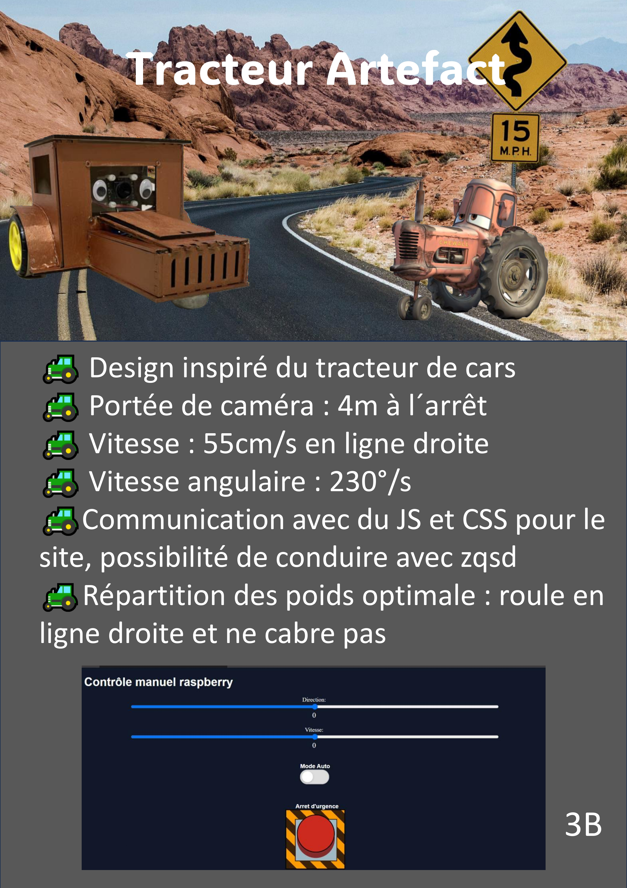

# Projet ARTEFACT 

## Groupe 3 / Équipe B - Dans la gova

Jules LEFÈVRE, Thomas LUCEREAU, Thaddée PLASZCZYNSKI, Frédéric SRICHANWIT.



Sur cette page, vous trouverez les dossiers suivants :

- Camera_Eval_Finale : Code des différentes fonctions de détection pour la caméra pour l'évaluation finale. Ce dossier contient :
    - ```Angle_Balise_i_vers_j.py``` : Contient une fonction pour calculer l'angle entre la balise ```ì``` et la balise ```j``` avec les données fournies par l'éclaireur.
    - ```acquisition_donnees.py``` : Contient les fonctions pour détecter les marqueurs Aruco.
    - ```prend_photo.py``` : Fichier test pour prendre une photo avec la caméra.
- Code_eval_intermediaire : Contient les différents fichiers pour l'évaluation intermédiaire: ensemble des codes individuels utilisé par l'équipe pour reussir l'éval intermédiare
- Code_evaluation_groupe : Code commun du groupe 3, dossier utilisé pour l'évaluation finale.
- decoupe : Fichiers ```svg``` utilisé pour la découpe laser.
- Outils_camera : Code des différentes fonctions de détection pour la caméra.
    - ```camera_eval_intermediaire.py``` : Contient le code pour effectuer le mode automatique de l'évaluation intermédiaire.
    - ```detecter_aruco.py``` : Contient les fonctions pour détecter les marqueurs Aruco.
    - ```prend_photo.py``` : Fichier test pour prendre une photo avec la caméra.
    - ```trouve_focale.py``` : Contient une fonction pour calculer la focale de la caméra, qui va nous servir pour la détection des Aruco.